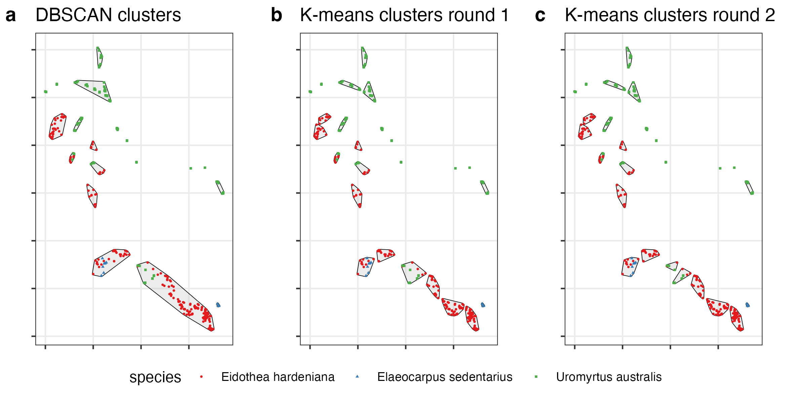

## Repository Overview

This repository supports the paper (***) and provides code and data for two illustrative examples. These examples demonstrate the application of spatial clustering methods, perimeter/area constraints, genetic data calculations, and risk assessments based on environmental data.

---

## Examples

### **Example 1: Data Subset from the Paper**


This example utilizes a subset of the data used in the paper to demonstrate the following:
- **Spatial Clustering:** Group data points based on spatial proximity.
- **Perimeter Limitation:** Apply constraints to limit the perimeter of clusters.


- **Genetic Data Calculation:** Compute genetic values (g-values) for clusters.
- **Risk Assessment:** Perform risk calculations based on vegetation data.


### **Example 2: Koala Observations in NSW**
This example uses Atlas of Living Australia (ALA) records of koalas in New South Wales (NSW) from 2022-2025. It includes:
- **High-Frequency Observation Areas:** Identify areas with high observation densities.
- **Area-Based Splitting:** Use maximum area constraints instead of perimeter constraints to subdivide larger clusters.


This example highlights the versatility of the clustering method for ecological management.

---

## Usage
1. Clone this repository:
   ```bash
   git clone https://github.com/eilishmcmaster/insitu_workflow.git
   ```
2. Open the R scripts for each example and follow the instructions in the comments.
3. Ensure the input data files are in the correct directory structure.

---

## Citation
(***)

---

For questions or feedback, please contact ***.

