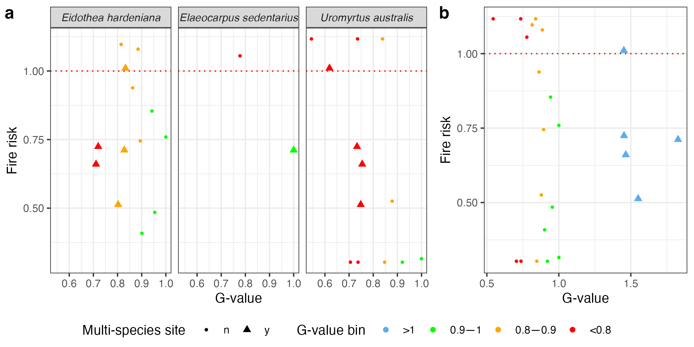
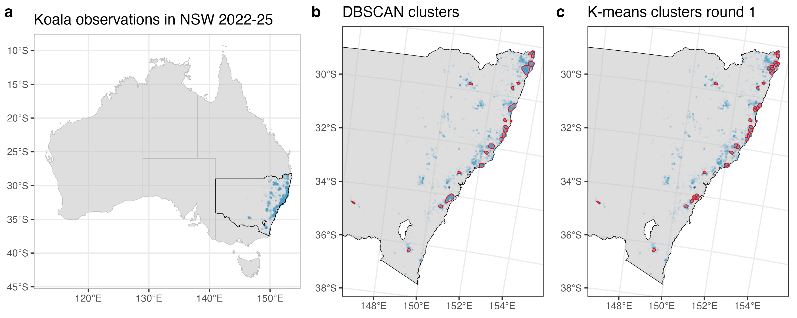

## Repository Overview

This repository supports the paper (***) and provides code and data for two illustrative examples. These examples demonstrate the application of spatial clustering methods, perimeter/area constraints, genetic data calculations, and risk assessments based on environmental data.

---

## Examples

### **Example 1: Data Subset from the Paper**


This example utilizes a subset of the data used in the paper to demonstrate the following:
- **Spatial Clustering:** Group data points based on spatial proximity.
- **Perimeter Limitation:** Apply constraints to limit the perimeter of clusters.
- **Genetic Data Calculation:** Compute genetic values (g-values) for clusters.
- **Risk Assessment:** Perform risk calculations based on vegetation data.




### **Example 2: Koala Observations in NSW**
This example uses Atlas of Living Australia (ALA) records of koalas in New South Wales (NSW) from 2022-2025. It includes:
- **High-Frequency Observation Areas:** Identify areas with high observation densities.
- **Area-Based Splitting:** Use maximum area constraints instead of perimeter constraints to subdivide larger clusters.



This example highlights the versatility of the clustering method for ecological management.

---

## Installation and Dependencies
To use the code in this repository, you will need:
- **R (version X.X.X or later)**
- The following R packages:
  - `sf`
  - `ggplot2`
  - `units`
  - `dplyr`
  - `raster` (if applicable)

You can install the required packages with:
```R
install.packages(c("sf", "ggplot2", "units", "dplyr", "raster"))
```

---

## Usage
1. Clone this repository:
   ```bash
   git clone https://github.com/yourusername/your-repo-name.git
   cd your-repo-name
   ```
2. Open the R scripts for each example (e.g., `example1.R` or `example2.R`) and follow the instructions in the comments.
3. Ensure the input data files are in the correct directory structure.

---

## Citation
(***)

---

For questions or feedback, please contact ***.

